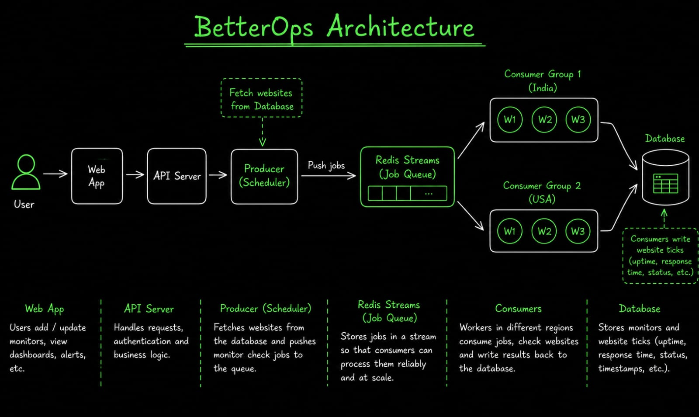
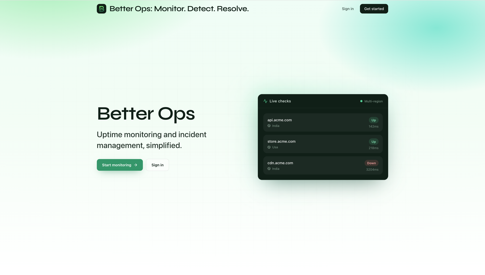
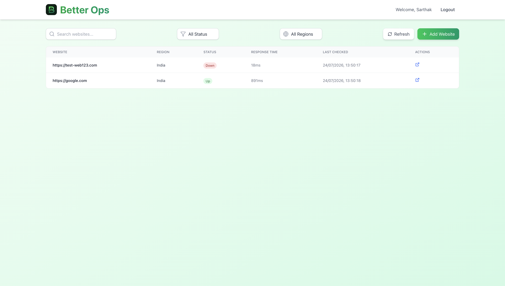
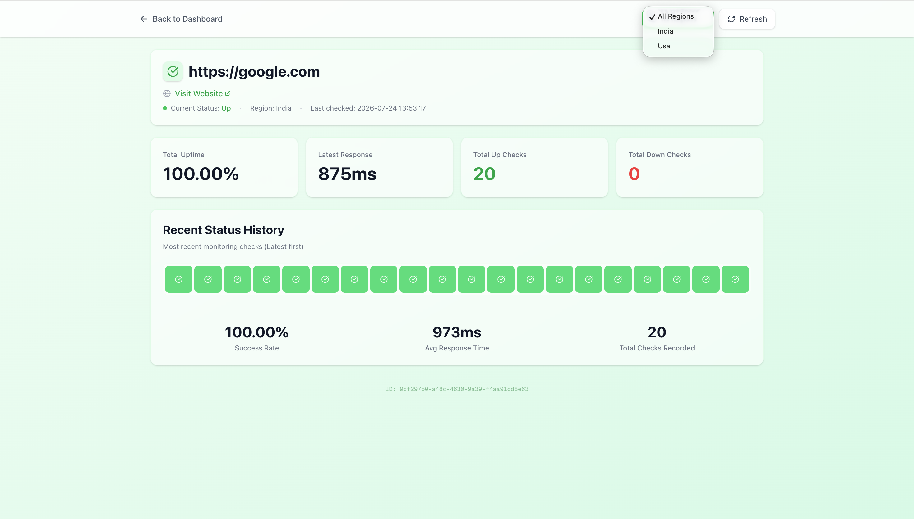
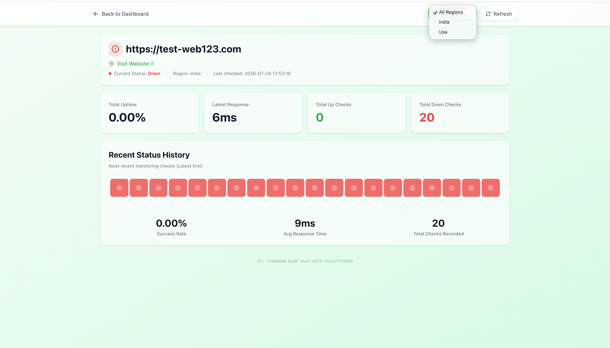

# Better Ops

Uptime monitoring and incident management, simplified.

Multi-region website checks powered by Redis Streams: add a URL, workers verify it from regions like India and the USA, and the dashboard shows status, response time, and history.

## Demo Video

▶️ [Watch the BetterOps Demo](https://youtu.be/lamJImwouwU)

## Screenshots

### Architecture

### Home

### Dashboard

### Website detail

## Stack

- **web** — Next.js dashboard & landing
- **api** — Express auth + website APIs
- **producer** — pushes sites to Redis Streams
- **consumer** — regional workers that check URLs and update website ticks
- **packages/db** — Prisma + Postgres
- **packages/redisstream** — shared Redis Stream helpers

## Deploy & CI/CD

Push app changes to `main` → **GitHub Actions** builds images → bumps tags in `ops/` → **Argo CD** syncs the cluster. See [ops/README.md](ops/README.md).

